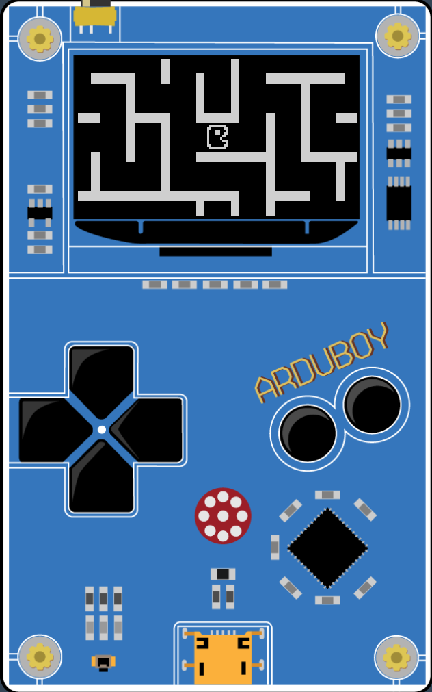

# Arduboy
Games created for the [Arduboy](https://arduboy.com/) miniature game system.

Maze Explorer: Version 1.0
--------------------------
 * Features tilemaps, smooth scrolling 
 * Uses [Hunt-and-Kill algorithm](http://weblog.jamisbuck.org/2011/1/24/maze-generation-hunt-and-kill-algorithm) to procedurally generate a new maze each time game is restarted (using the recursive backtracker maze generation algorithm quickly leads to errors as the system runs out of stack space)
